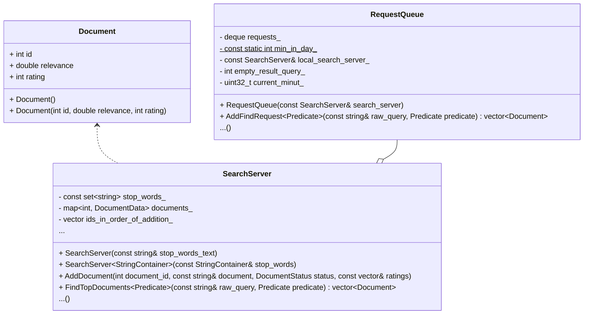

# Search-server

Учебный проект для закрепления навыков использования базовых понятий языка и стандартной библиотеки. С его помощью осуществляется возможность добавления, хранения и поиска текстовых документов по ключевым словам запроса.

## Структура проекта


<br>

### Основные структурные элементы:
- поисковый сервер - хранит стоп слова, информацию о добавленных документах и частоту упоминания конкретного слова в каждом документе
- 

## Download

Скачать репозиторий можно с помощью команды:

```
git clone git@github.com:alexkozlovvv/cpp-search-server.git
```

## Usage

На данном этапе проект не предполагает интерактивного взаимодействия с пользователем поскольку отсутствует обработка входных команд. Сейчас они задаются статически в теле программы. 

Алгоритм работы программы:
- Создается объект поискового сервера;
- С помощью контруктора передаются стоп слова; 
- Далее создается объект очереди запросов.

## Дальнейшее развитие

Необходимо добавить возможность интерактивного взаимодействия с пользователем с помощью терминала.
Добавить тесты для модульного тестирования компонентов архитектуры.


